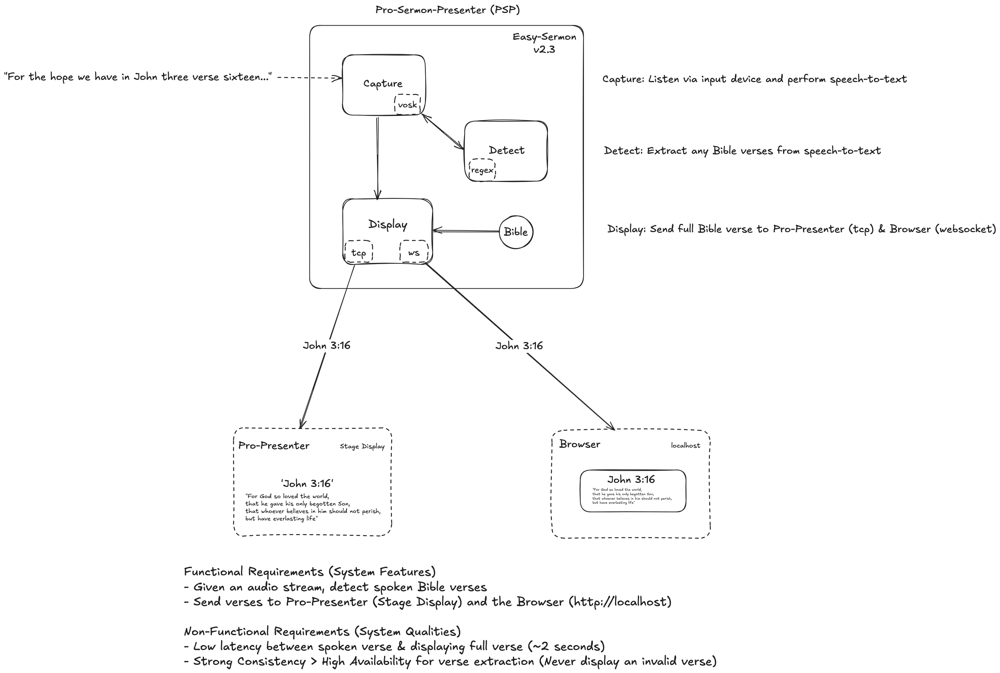

An application that listens to a live audio stream, recognizes any Bible verses, and displays the Scripture.

## Architecture



- **Audio Stream**: Capture audio from an input device.
- **Speech Recognition**: Utilize the Vosk speech model to convert audio to text.
- **Verse Detection**: Match texts against Bible verses using regular expressions (regex).
- **Display Output**: Send detected verses to Stage Display for live presentation.

## Requirements

- Rust (install via [rustup](https://rustup.rs/))
- Python (`v3.10`)
- Audio input device (microphone, etc)
- FFMPEG (`brew install ffmpeg` on macOS)
- [Vosk](https://alphacephei.com/vosk/models) (`small`, `lgraph`, `gigaspeech`, etc) - downloaded as part of build script (~4 GB).

## Usage

```
git clone https://github.com/chornge/easy_sermon.git
cd ~/PATH/to/easy_sermon
python3 -m venv venv
source venv/bin/activate
pip install -r api/requirements.txt
```

On macOS only - manually install system certs, run:

```
chmod +x get-certificates.sh

bash get-certificates.sh
```

Run:

```
cargo run --release
```

Navigate to `http://localhost` on the browser. Allow microphone access (if the prompt pops up).

```
"for the hope we have in john three verse sixteen" -> ['John 3:16']
"keeping in mind the consequences in romans six verse twenty three" -> ['Romans 6:23']
"nothing compares to the grace in ephesians two verse eight" -> ['Ephesians 2:8']
"showing how near salvation is in romans ten verse nine" -> ['Romans 10:9']
"finding true life in john fourteen verse six" -> ['John 14:6']
"and our identity in galatians two verse twenty" -> ['Galatians 2:20']
"we are never too far gone in first john one verse nine" -> ['1 John 1:9']
"for we celebrate a fresh start in second corinthians five verse seventeen" -> ['2 Corinthians 5:17']
"finding the blueprint for peace in philippians four verses six and seven" -> ['Philippians 4:6-7']
"while on the great commission in matthew twenty eight verse nineteen through twenty" -> ['Matthew 28:19-20']
```

## Limitations

• Struggles with `Nehemiah` and `Psalms`.

• The word `"verse"` must be present for accurate Bible verse extraction.
